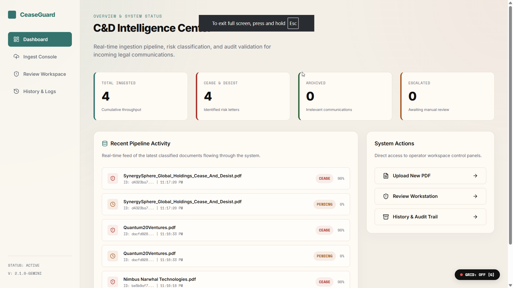
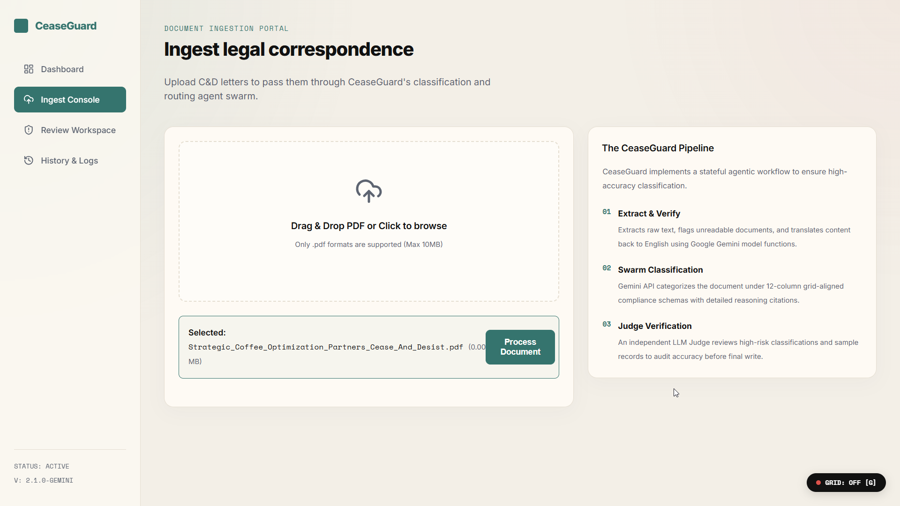
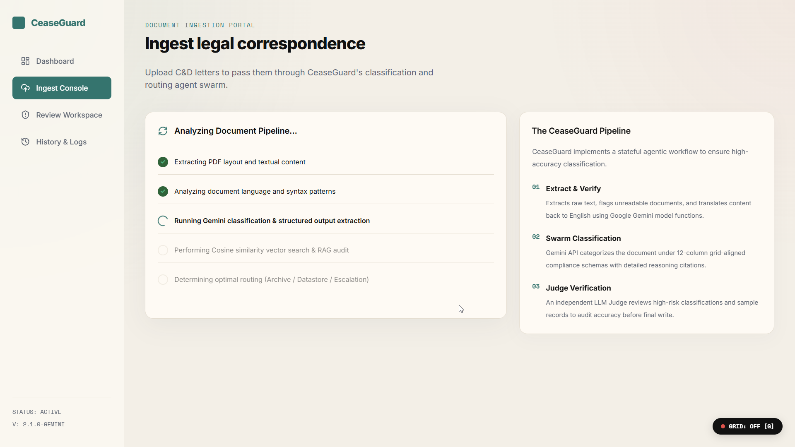
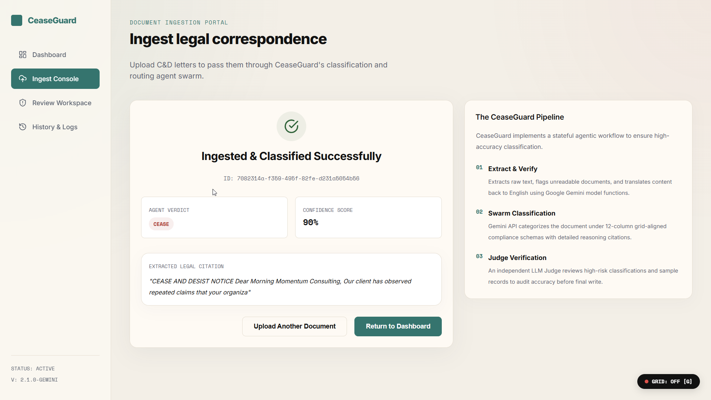
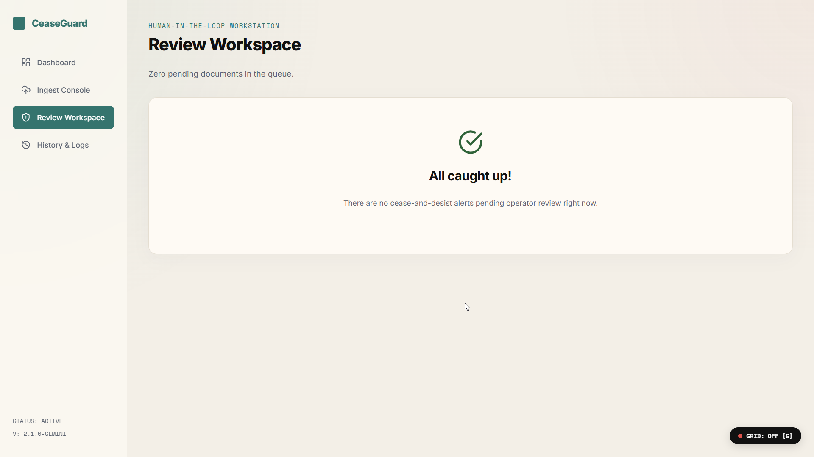
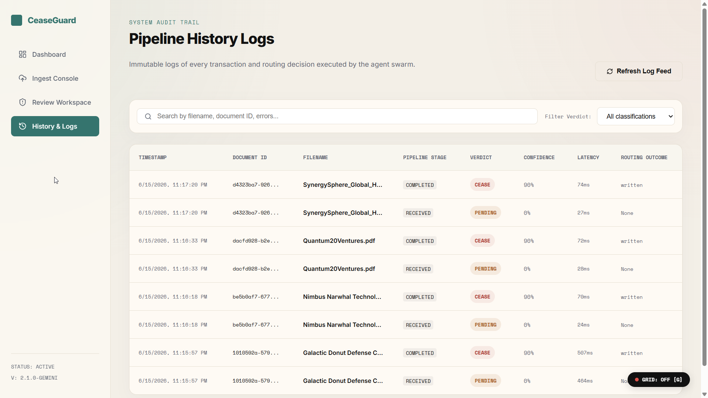

# CeaseGuard — Cease & Desist Document Intelligence System

CeaseGuard is a production-grade multi-agent document intelligence platform that automates the triage, risk classification, and routing of inbound **Cease & Desist** legal customer requests. 

Built with a hybrid **Next.js + FastAPI** serverless stack, it parses incoming PDFs, runs a stateful agent swarm using **Google Gemini**, embeds case contents for real-time **RAG similarity** checks, and presents manual review overrides inside a clean console designed on **Swiss Typography** and **Müller-Brockmann grid** systems.

---

## System Overview

### 1. Operations Dashboard
The main command center features real-time metrics, system statuses, quick workstation links, and an live pipeline transaction log feed.



### 2. Stateful Ingestion & Labor Illusion Pipeline
The ingestion console features a drag-and-drop file dropzone and a step-by-step checklist. It implements the **Labor Illusion** principle to demonstrate active agent checkpoints (Ingestion, Language, Classifier, RAG Index, Route) during processing.

| 1. PDF Ingestion | 2. Agent Swarm Checklist | 3. Pipeline Result |
|:---:|:---:|:---:|
|  |  |  |

### 3. Human-in-the-Loop Workstation
Escalated cases (uncertain labels or low-confidence metrics) are routed to a split-screen review queue showing full extracted text, document metadata, **RAG vector similarity recommendations**, and manual overrides.



### 4. Searchable History & Audit Trail
All completed transactions are logged immutably in database records and displayed in a searchable table filtered by keyword or classification status.



---

## Technical Stack & Features

* **LLM Orchestration**: Powered by **Google Gemini API** (`gemini-2.5-pro` for classification; `gemini-2.5-flash` for translations) using official `google-genai` Pydantic response schemas.
* **Stateful Agent Workflow**: Structured pipeline (`agents/workflow.py`) with transition interrupts.
* **Local vector RAG**: Indexing summaries using Gemini `text-embedding-004` and local Python cosine calculations.
* **Database Connection Proxy**: Connection manager supporting SQLite and PostgreSQL with runtime parameter translation.
* **Grotesque Swiss UI**: Müller-Brockmann grid design tokens, Inter webfonts, and a client-side layout grid guides overlay (Press the **`G`** key to toggle grid visibility).

---

## Quick Start (Run Locally)

### 1. Configure Credentials
Create a `.env` file in the root directory:
```bash
GEMINI_API_KEY=your_google_gemini_api_key
# Optional: DATABASE_URL=your_postgres_connection_string (Defaults to local SQLite)
```

### 2. Install Dependencies
```bash
# Install Python packages
pip install -r requirements.txt

# Install JavaScript packages
npm install
```

### 3. Start Dev Servers

Start the **FastAPI Backend** (Port 8000):
```bash
python -m uvicorn api.index:app --port 8000 --reload
```

Start the **Next.js Frontend** (Port 3000):
```bash
npm run dev
```

Open **[http://localhost:3000](http://localhost:3000)** in your browser.
